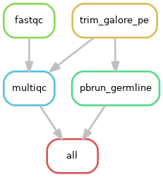
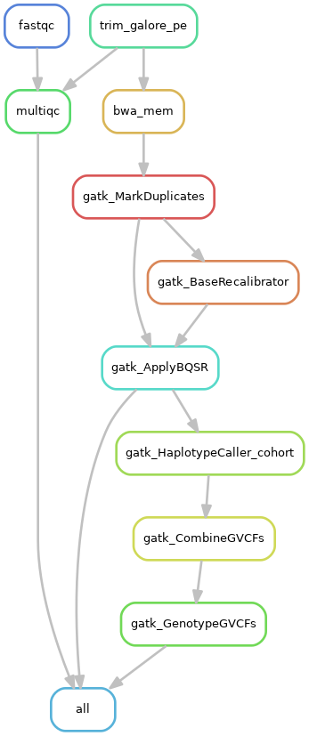
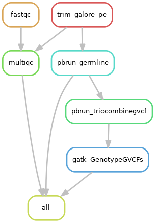

# human_genomics_pipeline

A Snakemake workflow to process single samples (unrelated individuals) or cohort samples (related individuals) of paired-end sequencing data (WGS or WES) using [bwa](http://bio-bwa.sourceforge.net/) and [GATK4](https://gatk.broadinstitute.org/hc/en-us). Quality control checks are also undertaken. The fastq files can be optionally trimmed with [Trim Galore](https://www.bioinformatics.babraham.ac.uk/projects/trim_galore/) and the pipeline can run on [NVIDIA GPU's](https://www.nvidia.com/en-gb/graphics-cards/) where [nvidia clara parabricks software is available](https://www.nvidia.com/en-us/docs/parabricks/quickstart-guide/software-overview/) for *significant* speedups in analysis times. This workflow is designed to follow the [GATK best practice workflow for germline short variant discovery (SNPs + Indels)](https://gatk.broadinstitute.org/hc/en-us/articles/360035535932-Germline-short-variant-discovery-SNPs-Indels-). This pipeline is designed to be followed by [vcf_annotation_pipeline](https://github.com/ESR-NZ/vcf_annotation_pipeline) and the data ingested into [scout](https://github.com/Clinical-Genomics/scout) for clinical interpretation. However, this pipeline also stands on it's own, taking the data from fastq to vcf (raw sequencing data to called variants). This pipeline has been developed with human genetic data in mind, however we designed it to be species agnostic. Genetic data from other species can be analysed by setting a species-specific reference genome and variant databases in the configuration file (but not all situations have been tested).

- [human_genomics_pipeline](#human_genomics_pipeline)
  - [Pipeline summary - single samples](#pipeline-summary---single-samples)
  - [Pipeline summary - single samples - GPU accelerated](#pipeline-summary---single-samples---gpu-accelerated)
  - [Pipeline summary - cohort samples](#pipeline-summary---cohort-samples)
  - [Pipeline summary - cohort samples - GPU accelerated](#pipeline-summary---cohort-samples---gpu-accelerated)
  - [Main output files](#main-output-files)
  - [Prerequisites](#prerequisites)
  - [Test human_genomics_pipeline](#test-human_genomics_pipeline)
  - [Run human_genomics_pipeline](#run-human_genomics_pipeline)
  - [Contribute back!](#contribute-back)

## Pipeline summary - single samples

1. Raw read QC ([FastQC](https://www.bioinformatics.babraham.ac.uk/projects/fastqc/) and [MultiQC](https://multiqc.info/))
2. Adapter trimming ([Trim Galore](https://www.bioinformatics.babraham.ac.uk/projects/trim_galore/)) (*optional*)
3. Alignment against reference genome ([Burrows-Wheeler Aligner](http://bio-bwa.sourceforge.net/))
4. Mark duplicates ([GATK MarkDuplicates](https://gatk.broadinstitute.org/hc/en-us/articles/4414594430619-GenotypeGVCFs))
5. Base recalibration ([GATK BaseRecalibrator](https://gatk.broadinstitute.org/hc/en-us/articles/360036898312-BaseRecalibrator) and [GATK ApplyBQSR](https://gatk.broadinstitute.org/hc/en-us/articles/360037055712-ApplyBQSR))
6. Haplotype calling ([GATK HaplotypeCalller](https://gatk.broadinstitute.org/hc/en-us/articles/360037225632-HaplotypeCaller))

## Pipeline summary - single samples - GPU accelerated

1. Raw read QC ([FastQC](https://www.bioinformatics.babraham.ac.uk/projects/fastqc/) and [MultiQC](https://multiqc.info/))
2. Adapter trimming ([Trim Galore](https://www.bioinformatics.babraham.ac.uk/projects/trim_galore/)) (*optional*)
3. Alignment against reference genome, mark duplicates, base recalibration and haplotype calling ([parabricks germline pipeline](https://docs.nvidia.com/clara/parabricks/v3.6.1/text/germline_pipeline.html))
   - *Equivalant to [Burrows-Wheeler Aligner](http://bio-bwa.sourceforge.net/), [GATK MarkDuplicates](https://gatk.broadinstitute.org/hc/en-us/articles/4414594430619-GenotypeGVCFs), [GATK BaseRecalibrator](https://gatk.broadinstitute.org/hc/en-us/articles/360036898312-BaseRecalibrator), [GATK ApplyBQSR](https://gatk.broadinstitute.org/hc/en-us/articles/360037055712-ApplyBQSR) and [GATK HaplotypeCalller](https://gatk.broadinstitute.org/hc/en-us/articles/360037225632-HaplotypeCaller)*

## Pipeline summary - cohort samples

1. Raw read QC ([FastQC](https://www.bioinformatics.babraham.ac.uk/projects/fastqc/) and [MultiQC](https://multiqc.info/))
2. Adapter trimming ([Trim Galore](https://www.bioinformatics.babraham.ac.uk/projects/trim_galore/)) (*optional*)
3. Alignment against reference genome ([Burrows-Wheeler Aligner](http://bio-bwa.sourceforge.net/))
4. Mark duplicates ([GATK MarkDuplicates](https://gatk.broadinstitute.org/hc/en-us/articles/4414594430619-GenotypeGVCFs))
5. Base recalibration ([GATK BaseRecalibrator](https://gatk.broadinstitute.org/hc/en-us/articles/360036898312-BaseRecalibrator) and [GATK ApplyBQSR](https://gatk.broadinstitute.org/hc/en-us/articles/360037055712-ApplyBQSR))
6. Haplotype calling ([GATK HaplotypeCalller](https://gatk.broadinstitute.org/hc/en-us/articles/360037225632-HaplotypeCaller))
7. Combine GVCF into multi-sample GVCF ([GATK CombineGVCFs](https://gatk.broadinstitute.org/hc/en-us/articles/360037593911-CombineGVCFs))
8. Genotyping ([GATK GenotypeGVCFs](https://gatk.broadinstitute.org/hc/en-us/articles/4414594430619-GenotypeGVCFs))

## Pipeline summary - cohort samples - GPU accelerated

1. Raw read QC ([FastQC](https://www.bioinformatics.babraham.ac.uk/projects/fastqc/) and [MultiQC](https://multiqc.info/))
2. Adapter trimming ([Trim Galore](https://www.bioinformatics.babraham.ac.uk/projects/trim_galore/)) (*optional*)
3. Alignment against reference genome, mark duplicates, base recalibration and haplotype calling ([parabricks germline pipeline](https://docs.nvidia.com/clara/parabricks/v3.6.1/text/germline_pipeline.html))
   - *Equivalant to [Burrows-Wheeler Aligner](http://bio-bwa.sourceforge.net/), [GATK MarkDuplicates](https://gatk.broadinstitute.org/hc/en-us/articles/4414594430619-GenotypeGVCFs), [GATK BaseRecalibrator](https://gatk.broadinstitute.org/hc/en-us/articles/360036898312-BaseRecalibrator), [GATK ApplyBQSR](https://gatk.broadinstitute.org/hc/en-us/articles/360037055712-ApplyBQSR) and [GATK HaplotypeCalller](https://gatk.broadinstitute.org/hc/en-us/articles/360037225632-HaplotypeCaller)*
4. Combine GVCF into multi-sample GVCF ([parabricks trio combine gvcf](https://docs.nvidia.com/clara/parabricks/v3.6/text/joint_calling.html#trio-combine-gvcf))
   - *Equivalent to [GATK CombineGVCFs](https://gatk.broadinstitute.org/hc/en-us/articles/360037593911-CombineGVCFs)*
5. Genotyping ([GATK GenotypeGVCFs](https://gatk.broadinstitute.org/hc/en-us/articles/4414594430619-GenotypeGVCFs))

## Main output files

Single samples:

- `results/qc/multiqc_report.html`
- `results/mapped/sample1_recalibrated.bam`
- `results/called/sample1_raw_snps_indels.vcf`

Cohort samples:

- `results/qc/multiqc_report.html`
- `results/mapped/sample1_recalibrated.bam`
- `results/mapped/sample2_recalibrated.bam`
- `results/mapped/sample3_recalibrated.bam`
- `results/called/proband1_raw_snps_indels.vcf`

## Prerequisites

- **Prerequisite hardware:** [NVIDIA GPUs](https://www.nvidia.com/en-gb/graphics-cards/) (for GPU accelerated runs) (tested with NVIDIA V100)
- **Prerequisite software:** [NVIDIA CLARA parabricks and dependencies](https://www.nvidia.com/en-us/docs/parabricks/local-installation/) (for GPU accelerated runs) (tested with parabricks version 3.6.1-1), [Git](https://git-scm.com/) (tested with version 1.8.3.1), [Conda](https://docs.conda.io/projects/conda/en/latest/index.html) (tested with version 4.11.0), [Mamba](https://github.com/TheSnakePit/mamba) (tested with version 0.19.1)

## Test human_genomics_pipeline

The provided [test dataset](./test) can be used to test running this pipeline on a new machine, or test pipeline developments/releases.

## Run human_genomics_pipeline

See the docs for a walkthrough guide for running [human_genomics_pipeline](https://github.com/ESR-NZ/human_genomics_pipeline) on:

- [A single machine like a laptop or single server/computer](./docs/running_on_a_single_machine.md)
- [A high performance cluster](./docs/running_on_a_hpc.md)

## Contribute back!

- Raise issues in [the issues page](https://github.com/ESR-NZ/human_genomics_pipeline/issues)
- Create feature requests in [the issues page](https://github.com/ESR-NZ/human_genomics_pipeline/issues)
- Start a discussion in [the discussion page](https://github.com/ESR-NZ/human_genomics_pipeline/discussions)
- Contribute your code! Create your own branch from the [development branch](https://github.com/ESR-NZ/human_genomics_pipeline/tree/dev) and create a pull request to the [development branch](https://github.com/ESR-NZ/human_genomics_pipeline/tree/dev) once the code is on point!

Contributions and feedback are always welcome! :blush:
