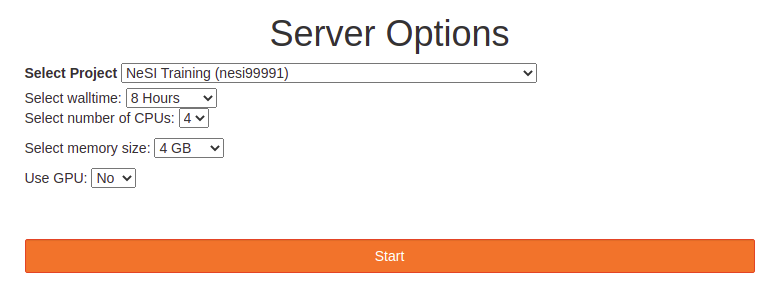

# Run human_genomics_pipeline on NeSi - New Zealand's eScience Infrasructure

**This document is a work in progress and this documentation currently won't get you setup and running the pipeline on Nesi**

## Table of contents

- [Run human_genomics_pipeline on NeSi - New Zealand's eScience Infrasructure](#run-human_genomics_pipeline-on-nesi---new-zealands-escience-infrasructure)
  - [Table of contents](#table-of-contents)
  - [1. Apply for access to NeSi](#1-apply-for-access-to-nesi)
  - [2. Fork the pipeline repo to a personal or lab account](#2-fork-the-pipeline-repo-to-a-personal-or-lab-account)
  - [3. Connect to Jupyter on NeSI](#3-connect-to-jupyter-on-nesi)
  - [4. Get prerequisite software](#4-get-prerequisite-software)
  - [5. Take the pipeline to the data on NeSi](#5-take-the-pipeline-to-the-data-on-nesi)
  - [6. Setup files and directories](#6-setup-files-and-directories)
  - [7. Create a local copy of the GATK resource bundle (either b37 or hg38)](#7-create-a-local-copy-of-the-gatk-resource-bundle-either-b37-or-hg38)
    - [b37](#b37)
    - [hg38](#hg38)
  - [8. Modify the configuration file](#8-modify-the-configuration-file)
    - [Overall workflow](#overall-workflow)
    - [Pipeline resources](#pipeline-resources)
      - [Trimming](#trimming)
    - [Base recalibration](#base-recalibration)
  - [9. Configure to run on a HPC](#9-configure-to-run-on-a-hpc)
  - [10. Modify the run scripts](#10-modify-the-run-scripts)
  - [11. Create and activate a conda environment with python and snakemake installed](#11-create-and-activate-a-conda-environment-with-python-and-snakemake-installed)
  - [12. Run the pipeline](#12-run-the-pipeline)
  - [13. Evaluate the pipeline run](#13-evaluate-the-pipeline-run)
  - [14. Commit and push to your forked version of the github repo](#14-commit-and-push-to-your-forked-version-of-the-github-repo)
  - [15. Repeat step 12 each time you re-run the analysis with different parameters](#15-repeat-step-12-each-time-you-re-run-the-analysis-with-different-parameters)
  - [16. Raise issues, create feature requests or create a pull request with the upstream repo to merge any useful changes to the pipeline (optional)](#16-raise-issues-create-feature-requests-or-create-a-pull-request-with-the-upstream-repo-to-merge-any-useful-changes-to-the-pipeline-optional)

## 1. Apply for access to NeSi

See their website [here](https://www.nesi.org.nz/services/applyforaccess)

## 2. Fork the pipeline repo to a personal or lab account

See [here](https://help.github.com/en/github/getting-started-with-github/fork-a-repo#fork-an-example-repository) for help forking a repository

## 3. Connect to Jupyter on NeSI

1. Follow [https://jupyter.nesi.org.nz/hub/login](https://jupyter.nesi.org.nz/hub/login)
2. <p>Enter NeSI username, HPC password and 6 digit second factor token (as set on <a href="https://my.nesi.org.nz/account/hpc-account">MyNeSI</a>)<br></p>
3. <p>Choose the appropriate server options, for example<br></p>
4. <p>Start a terminal session from the JupyterLab launcher<br></p>

When you connect to NeSI JupyterLab you always start in a new hidden directory. To make sure you can find your work next time, you should change to another location. Here we will switch to our project directory, since home directories can run out of space quickly. If you are using your own project use that instead of "nesi99991".

```bash
mkdir -p /nesi/project/nesi99991/snakemake20210914/$USER
cd /nesi/project/nesi99991/snakemake20210914/$USER
```

You can also navigate to the above directory in the JupyterLab file browser, which can be useful for editing files and viewing images and html documents.

## 4. Get prerequisite software

TODO: See is/where [NVIDIA GPUs](https://www.nvidia.com/en-gb/graphics-cards/) and [NVIDIA CLARA PARABRICKS and dependencies](https://www.nvidia.com/en-us/docs/parabricks/local-installation/) are installed

Other software required to get setup and run the pipeline:

- [Git](https://git-scm.com/) (tested with version 2.7.4)
- [Conda](https://docs.conda.io/projects/conda/en/latest/index.html) (tested with version 4.8.2)
- [Mamba](https://github.com/TheSnakePit/mamba) (tested with version 0.4.4)
- [gsutil](https://pypi.org/project/gsutil/) (tested with version 4.52)
- [gunzip](https://linux.die.net/man/1/gunzip) (tested with version 1.6)

We will now configure conda. Note that this will change your existing conda configuration if you already have one. In that case, we recommend you rename your current conda configuration file (`mv ~/.condarc ~/.condarc.bkp`) and then restore it after the workshop (`mv ~/.condarc.bkp ~/.condarc`).

On NeSI we have lots of software preinstalled to simplify things for our users. To load Miniconda run the following in the terminal:

```bash
module purge
module load Miniconda3
source $(conda info --base)/etc/profile.d/conda.sh
```

Next, [set up your channels](https://bioconda.github.io/user/install.html#set-up-channels) (channels are locations where packages/software are can be installed from)

```bash
conda config --add channels defaults
conda config --add channels bioconda
conda config --add channels conda-forge
```

Load git module

```bash
module load git
```

TODO: Figure out how to install gsutil and mamba

Install gsutil

```bash

```

Install mamba

```bash

```

[gunzip](https://linux.die.net/man/1/gunzip) is already installed system wide

## 5. Take the pipeline to the data on NeSi

Clone the forked [human_genomics_pipeline](https://github.com/ESR-NZ/human_genomics_pipeline) repo into the same directory as your paired end fastq data to be processed.

See [here](https://help.github.com/en/github/getting-started-with-github/fork-a-repo#keep-your-fork-synced) for help cloning a repository

## 6. Setup files and directories

Required folder structure and file naming convention:

```bash

.
|___fastq/
|     |___sample1_1.fastq.gz
|     |___sample1_2.fastq.gz
|     |___sample2_1.fastq.gz
|     |___sample2_2.fastq.gz
|     |___ ...
|
|___human_genomics_pipeline/

```

If you're analysing cohort's of samples, you will need an additional directory with a [pedigree file](https://gatk.broadinstitute.org/hc/en-us/articles/360035531972-PED-Pedigree-format) for each cohort/family using the following folder structure and file naming convention:

```bash

.
|___fastq/
|     |___sample1_1.fastq.gz
|     |___sample1_2.fastq.gz
|     |___sample2_1.fastq.gz
|     |___sample2_2.fastq.gz
|     |___ ...
|
|___pedigrees/
|     |___proband1_pedigree.ped
|     |___proband2_pedigree.ped
|     |___ ...
|
|___human_genomics_pipeline/

```

Requirements:

- Input paired end fastq files need to identified with `_1` and `_2` (not `_R1` and `_R2`)
- Currently, the filenames of the pedigree files need to be labelled with the name of the proband/individual affected with the disease phenotype in the cohort (we will be working towards removing this requirement)
- Singletons and cohorts need to be run in separate pipeline runs

Assumptions:

- There is one proband/individual affected with the disease phenotype of interest in a given cohort (one individual with a value of 2 in the 6th column of the pedigree file)

## 7. Create a local copy of the [GATK resource bundle](https://gatk.broadinstitute.org/hc/en-us/articles/360035890811-Resource-bundle) (either b37 or hg38)

### b37

Download from [Google Cloud Bucket](https://console.cloud.google.com/storage/browser/gatk-legacy-bundles/b37?prefix=)

```bash
gsutil cp -r gs://gatk-legacy-bundles/b37/ /where/to/download/
```

### hg38

Download from [Google Cloud Bucket](https://console.cloud.google.com/storage/browser/genomics-public-data/resources/broad/hg38/v0)

```bash
gsutil cp -r gs://genomics-public-data/resources/broad/hg38/ /where/to/download/
```

## 8. Modify the configuration file

Edit 'config.yaml' found within the config directory

### Overall workflow

Specify whether the data is to be analysed on it's own ('Single') or as a part of a cohort of samples ('Cohort'). For example:

```yaml
DATA: "Single"
```

Specify whether the pipeline should be GPU accelerated where possible (either 'Yes' or 'No', this requires [NVIDIA GPUs](https://www.nvidia.com/en-gb/graphics-cards/) and [NVIDIA CLARA PARABRICKS](https://www.nvidia.com/en-us/docs/parabricks/local-installation/))

```yaml
GPU_ACCELERATED: "No"
```

Set the the working directories to the reference human genome file (b37 or hg38). For example:

```yaml
REFGENOME: "/home/lkemp/publicData/b37/human_g1k_v37_decoy.fasta"
```

Set the the working directory to your dbSNP database file (b37 or hg38). For example:

```yaml
dbSNP: "/home/lkemp/publicData/b37/dbsnp_138.b37.vcf"
```

Set the the working directory to a temporary file directory. For example:

```yaml
TEMPDIR: "/home/lkemp/tmp/"
```

If analysing WES data, pass a design file (.bed) indicating the genomic regions that were sequenced (see [here](https://leahkemp.github.io/documentation/human_genomic_pipelines/design_files.html) for more information on accessing design files). Also set the level of padding by passing the amount of padding in base pairs. For example:

*If NOT analysing WES data, leave these fields blank*

```yaml
WES:
  # File path to the exome capture regions over which to operate
  INTERVALS: "/home/lkemp/publicData/sure_select_human_all_exon_V7/S31285117_Padded.bed"
  # Padding (in bp) to add to each region
  PADDING: "100"
```

### Pipeline resources

These settings allow you to configure the resources per rule/sample

Set the number of threads to use per sample/rule for multithreaded rules (`rule trim_galore_pe` and `rule bwa_mem`). Multithreading will significantly speed up these rules, however the improvements in speed will diminish beyond 8 threads. If desired, a different number of threads can be set for these multithreaded rules by utilising the `--set-threads` flag in the runscript (see step 6).

```yaml
THREADS: 8
```

Set the maximum memory usage per rule/sample (eg. '40g' for 40 gigabytes, this should suffice for exomes)

```yaml
MAXMEMORY: "40g"
```

Set the maximum number of GPU's to be used per rule/sample for gpu-accelerated runs (eg `1` for 1 GPU)

```yaml
GPU: 1
```

It is a good idea to consider the number of samples that you are processing. For example, if you set `THREADS: "8"` and set the maximum number of cores to be used by the pipeline in the run script to `-j 32` (see step 6), a maximum of 3 samples will be able to run at one time for these rules (if they are deployed at the same time), but each sample will complete faster. In contrast, if you set `THREADS: "1"` and `-j 32`, a maximum of 32 samples could be run at one time, but each sample will take longer to complete. This also needs to be considered when setting `MAXMEMORY` + `--resources mem_mb` and `GPU` + `--resources gpu`.

#### Trimming

Specify whether the raw fastq reads should be trimmed (either 'Yes' or 'No'). For example:

```yaml
TRIM: "Yes"
```

If trimming the raw fastq reads, set the [trim galore](https://github.com/FelixKrueger/TrimGalore/blob/master/Docs/Trim_Galore_User_Guide.md) adapter trimming parameters. Choose one of the common adapters such as Illumina universal, Nextera transposase or Illumina small RNA with `--illumina`, `--nextera` or `--small_rna`. Alternatively, pass adapter sequences to the `-a` and `-a2` flags. If not set, trim galore will try to auto-detect the adapter based on the fastq reads.

```yaml
TRIMMING:
  ADAPTERS: "--illumina"
```

### Base recalibration

Pass the resources to be used to recalibrate bases with [gatk BaseRecalibrator](https://gatk.broadinstitute.org/hc/en-us/articles/360036726891-BaseRecalibrator), these known polymorphic sites will be used to exclude regions around known polymorphisms from analysis. Note. you can include as many or a little resources, but you'll need at least one recalibration resource file. For example:

```yaml
RECALIBRATION:
  RESOURCES:
    - /home/lkemp/publicData/b37/dbsnp_138.b37.vcf
    - /home/lkemp/publicData/b37/Mills_and_1000G_gold_standard.indels.b37.vcf
    - /home/lkemp/publicData/b37/1000G_phase1.indels.b37.vcf
```

## 9. Configure to run on a HPC

TODO: adapt this to NeSi's setup

*This will deploy the non-GPU accelerated rules to slurm and deploy the GPU accelerated rules locally (pbrun_fq2bam, pbrun_haplotypecaller_single, pbrun_haplotypecaller_cohort). Therefore, if running the pipeline gpu accelerated, the pipeline should be deployed from the machine with the GPU's.*

In theory, this cluster configuration should be adaptable to other job scheduler systems, but here I will provide a simple example for deploying this pipeline to [slurm](https://slurm.schedmd.com/).

Configure `account:` and `partition:` in the default section of 'cluster.json' in order to set the parameters for slurm sbatch (see documentation [here](https://snakemake.readthedocs.io/en/stable/snakefiles/configuration.html#cluster-configuration-deprecated) and [here](https://slurm.schedmd.com/)). For example:

```json
{
    "__default__" :
    {
        "account" : "lkemp",
        "partition" : "prod",
        "output" : "logs/slurm-%j_{rule}_{wildcards.sample}.out"
    }
}
```

There are a plethora of additional slurm parameters that can be configured (and can be configured per rule). If you set additional slurm parameters, remember to pass them to the `--cluster` flag in the runscripts. See [here](https://snakemake-on-nesi.sschmeier.com/snake.html#slurm-and-nesi-specific-setup) and [here](https://hpc-carpentry.github.io/hpc-python/17-cluster/) for good working examples.

## 10. Modify the run scripts

TODO: adapt this to NeSi's setup

Set the number maximum number of cores to be used with the `--cores` flag and the maximum amount of memory to be used (in megabytes) with the `resources mem_mb=` flag. If running GPU accelerated, also set the maximum number of GPU's to be used with the `--resources gpu=` flag. For example:

Dry run (dryrun_hpc.sh):

```bash
snakemake \
--dryrun \
--cores 32 \
--resources mem_mb=150000 \
--resources gpu=2 \
--use-conda \
--conda-frontend mamba \
--configfile ../config/config.yaml \
--cluster-config ../config/cluster.json \
--cluster "sbatch -A {cluster.account} \
-p {cluster.partition} \
-o {cluster.output}"
```

Full run (run_hpc.sh):

```bash
snakemake \
--cores 32 \
--resources mem_mb=150000 \
--resources gpu=2 \
--use-conda \
--conda-frontend mamba \
--configfile ../config/config.yaml \
--cluster-config ../config/cluster.json \
--cluster "sbatch -A {cluster.account} \
-p {cluster.partition} \
-o {cluster.output}"
```

See the [snakemake documentation](https://snakemake.readthedocs.io/en/v4.5.1/executable.html#all-options) for additional run parameters.

## 11. Create and activate a conda environment with python and snakemake installed

```bash
cd ./human_genomics_pipeline/workflow/
mamba env create -f pipeline_run_env.yml
conda activate pipeline_run_env
```

## 12. Run the pipeline

First carry out a dry run

```bash
bash dryrun_hpc.sh
```

If there are no issues, start a full run

```bash
bash run_hpc.sh
```

## 13. Evaluate the pipeline run

Generate an interactive html report

```bash
bash report.sh
```

## 14. Commit and push to your forked version of the github repo

To maintain reproducibility, commit and push:

- All configuration files
- All run scripts
- The final report

## 15. Repeat step 12 each time you re-run the analysis with different parameters

## 16. Raise issues, create feature requests or create a pull request with the [upstream repo](https://github.com/ESR-NZ/human_genomics_pipeline) to merge any useful changes to the pipeline (optional)

See [the README](https://github.com/ESR-NZ/human_genomics_pipeline#contribute-back) for info on how to contribute back to the pipeline!
